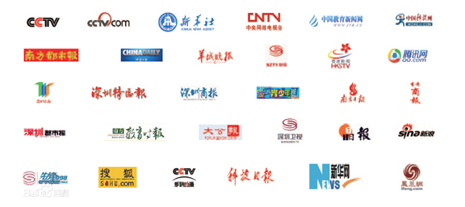
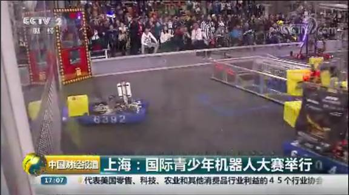
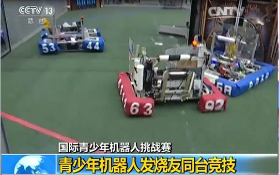

<head>
    <link rel="stylesheet" type="text/css" href="style.css">
    <title>Dimension Creators</title>
</head>
<header>
    <a class="a0" href="/">首页</a>
    <a class="a0" href="/index.html#团队概况">关于我们</a>
    <a class="a0" href="https://www.firstinspires.org/" target=_blank>FIRST 官网</a>
    <a class="a0" href="http://www.7zwd.com/" target=_blank>学校官网</a>
    <a class="a1" href="sponsor.html">赞助我们</a>
    
Dimension Creators

    
成都七中万达学校校队

</header>

## 团队概况

### 介绍

#### 学校简介

成都七中万达学校是2011年成立的一所公立完全中学。由万达集团部分捐资新建，金牛区政府举办，成都七中领办。是百年名校成都七中教育集团的一名新成员。是成都市为满足人民群众对优质教育资源的需求，在成都市城区西北片打造的一所名优中学。

成都市政府对成都七中万达学校定位为高起点、高标准、高规格、高品位、高质量、高素质。学校将以七中的管理团队领导，以七中的专家骨干引领，以七中的办学品位追求，着力建立一支充满爱心、富有激情、协作进取、技艺精湛的教师队伍；培养具有民族情怀、国际视野、卓越追求、务实作风的杰出人才；打造一所管理规范、质量一流、特色凸显的国际化、现代化名校。

#### [FRC](https://www.firstinspires.org) 赛事介绍

FRC 比赛，即国际 9-12 年级中学生机器人对战赛 (FIRST Robotics Competition)，是一个由 FIRST (For Inspiration and Recognition of Science and Technology) 集团发起的、在世界范围内有影响力的国际机器人比赛。由发明家 Dean Kamen 创立的 FIRST 机构，目的是激发青少年对科学与技术的兴趣。

FRC (FIRST Robotics Competition) 是一个国际高中生机器人比赛。各队学生的辅导员大部分由大学生志愿者，中学老师或家长担任。每年，各队学生与他们的辅导员在一月份比赛规则下发后规定的六周内设计，加工，组装，编程一个参赛机器人。机器人需要的功能可以包括投球射门，飞盘射门，爬绳子登高，在横梁上保持平衡等等。比赛内容每年不同，保持着每年各队的兴奋感与新鲜感，赛场也可以顺应时代而改变。各队每年将会得到一定的标准零件，同时也可以在规定预算与时间之内自行加工/购买特殊零件来建造机器人。

- 合作媒体：

  

- 我队成员接受 CCTV-2 采访

- 我队机器人在 CCTV-2 和 CCTV-13 的镜头

### 获奖经历

- 2016 年和 2018 年在 CRC（FRC 中国）获奖

<footer>
©2021 成都七中万达学校 电子机械社 

联系我们
<li><a href="mailto:mitota@163.com">指导老师</a></li>
<li><a href="mailto:2057246409@qq.com">社长</a></li>

</footer>

